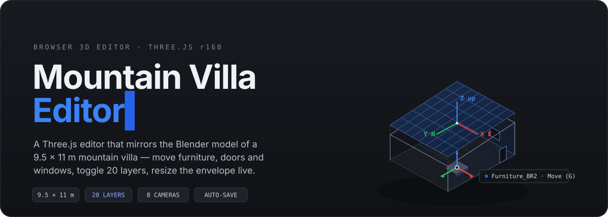
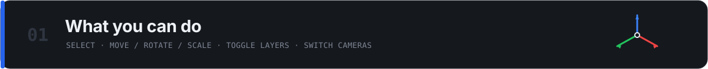
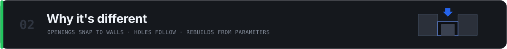
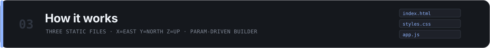
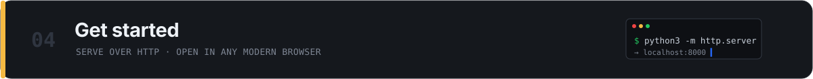

<p align="center">
  
</p>

<p align="center">
  <a href="https://b2qu0y0mhumeod53i1psi7xf.156.67.216.187.sslip.io"><b>▶ Live editor</b></a>
  &nbsp;·&nbsp;
  <a href="https://github.com/xidik12/mountain-villa-editor">Repository</a>
  &nbsp;·&nbsp;
  Three.js r160 &nbsp;·&nbsp; no build step &nbsp;·&nbsp; runs in any modern browser
</p>

**Mountain Villa Editor** is a single-page, browser-based 3D editor that mirrors a Blender model of a 9.5 × 11 m mountain villa. Open it and you get the whole building live: click any piece of furniture, door, or window to select it and drag it with a gizmo, toggle each of the 20 layers, jump between preset cameras, and resize the envelope or swap the roof and watch the villa rebuild. Every edit auto-saves to your own browser, and you can export the state as JSON to share or back up.

No install, no CAD licence, no build tooling — three static files and a CDN import of Three.js.

<br>



- **Select and transform anything** — click an object to select it; a Blender-style gizmo centers on it. Switch between **Move (G)**, **Rotate (R)**, and **Scale (S)**; constrain to one axis with **X / Y / Z**, or release back to all axes with **A**.
- **Orbit the whole villa** — left-drag to orbit, right-drag to pan, scroll to zoom, with an optional **orthographic** projection.
- **20 layers** — show or hide site, foundation, columns, beams, exterior/interior walls, eaves, roof, ceilings, doors, windows, seven per-room furniture collections, lighting fixtures, and construction annotations. Each object also has its own visibility toggle and delete button in the layer tree.
- **8 preset cameras** — five golden-hour aerials (SW / S / N / W / E), a top-down plan, and two cutaways that automatically hide the roof, ceilings, eaves, and lighting so you can see inside.
- **Two modes** — **Finished** (full villa with roof, finishes, and furniture) or **Construction** (structural columns, beams, and dimension annotations).
- **Reshape the building** — edit envelope X/Y, the low and high wall tops, and the roof type (**shed / hip / flat**), then hit **Apply** to rebuild.
- **Undo / redo, 50 deep** — `⌘Z` / `⌘⇧Z` (or `Ctrl+Z` / `Ctrl+Y`), even while an input is focused.

<br>



Most quick 3D viewers just let you nudge boxes around. This editor understands the building:

- **Openings cut real holes.** Drag a door or window and release — it snaps back onto its wall plane, and the wall rebuilds itself into segments *around* the opening so the hole follows the object. Move it, scale it, or hide it and the wall fills back in. Drag it more than half a metre off the wall and it detaches cleanly.
- **The model is parameter-driven.** The villa isn't a frozen mesh — it's generated from a `params` object (dimensions, roof pitch, wall thickness, a 48-panel / 19.68 kW rooftop solar array, and more). Change a parameter, call the builder, and the whole villa regenerates.
- **It mirrors the real spec.** Coordinates match the source model exactly — **X = east, Y = north, Z = up**, origin at the south-west outer corner — so what you see lines up with the Blender file and the drawings.

<br>



The entire app is three files, served statically:

| File | What it holds |
|---|---|
| `index.html` | Markup, the sidebar UI, and the import map that loads Three.js r160 from the unpkg CDN |
| `styles.css` | The dark editor theme and the responsive collapsible sidebar |
| `app.js` | Scene, materials, the parameter-driven villa builder, and all interaction (~1,800 lines) |

Because it loads Three.js as an ES module from a CDN, the page must be served over HTTP — opening `index.html` from `file://` will not work.

**Poke it from the console.** A few globals are exposed for tinkering in DevTools:

```js
window.layers        // { 'Walls_Exterior': Group, 'Furniture_Master': Group, … }
window.params        // { envX, envY, wallTopZ, peakZ, roofType, pvPanels, … }
window.buildVilla()  // rebuild everything from the current params
window.scene         // the Three.js scene

// e.g. hide the roof, then raise the ridge and rebuild:
layers.Roof.visible = false;
params.peakZ = 6.0; buildVilla();
```

<br>



Clone the repo and serve the folder over HTTP:

```bash
git clone https://github.com/xidik12/mountain-villa-editor.git
cd mountain-villa-editor
python3 -m http.server 8000
```

Then open **http://localhost:8000**. Any static server works — `npx serve .`, `php -S localhost:8000`, etc. — or just visit the [live editor](https://b2qu0y0mhumeod53i1psi7xf.156.67.216.187.sslip.io).

### Controls

| Action | How |
|---|---|
| Orbit camera | Left-drag the canvas |
| Pan | Right-drag the canvas |
| Zoom | Scroll wheel |
| Select object | Click it |
| Move selected | Drag the colored gizmo arrows |
| Rotate / Scale | Press **R** / **S** (or the mode buttons) |
| Constrain to one axis | Press **X**, **Y**, or **Z** while the gizmo is up |
| All axes again | Press **A** |
| Undo / Redo | `⌘Z` / `⌘⇧Z` (or `Ctrl+Z` / `Ctrl+Y`) |
| Deselect | Press **Esc** or click empty space |

### Save & share

- **Auto-save.** Every tweak is written to your browser's `localStorage`, scoped per browser per device, and restored on reload.
- **Export / import.** Click **⬇ Download JSON** in the *File* panel to export a state file; send it to someone and they click **⬆ Load JSON** to apply it.
- **Reset.** **↺ Reset to defaults** clears local state and reloads the canonical layout.

### Deploy

The editor is plain static files, so it runs behind any static web server. A `Dockerfile` + `nginx.conf` give you a one-command production container. See **[DEPLOY.md](./DEPLOY.md)** for Coolify, `rsync`, and raw-Docker recipes.

<br>

## Known limitations

- **No collision detection.** Nothing stops you from dragging a bed through a wall — handy for inspection, but there are no physical constraints.
- **Single-user state.** Edits live in each visitor's own browser and travel via exported JSON. Live shared state (everyone seeing the same edits at once) would need a small backend — a ~30-line `GET /state` + `PUT /state` server is enough.

## License

No license file is included yet; treat this repository as all-rights-reserved unless the owner states otherwise. See the [repository](https://github.com/xidik12/mountain-villa-editor) for the latest.
